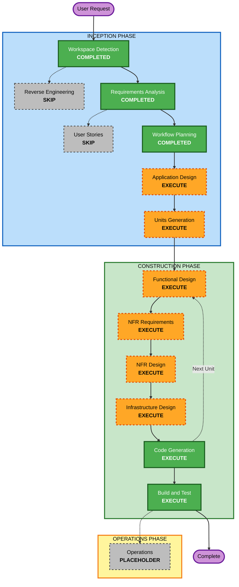

# Execution Plan — todo-mcp

## Detailed Analysis Summary

### Change Impact Assessment

| Area | Impact | Description |
|---|---|---|
| User-facing | Yes | New MCP tools exposed to Claude Desktop |
| Structural | Yes | New service from scratch — MCP server + Postgres |
| Data model | Yes | New todo schema with migrations (Alembic) |
| API changes | Yes | New FastMCP tool contracts |
| NFR impact | Yes | Security baseline (full), PBT (partial), structured logging, Docker |

### Risk Assessment

| Dimension | Level | Rationale |
|---|---|---|
| Overall risk | **Medium** | Moderate complexity — new data model, MCP protocol, Docker multi-container, soft-delete, filter/sort/pagination |
| Rollback | Easy | Greenfield — no existing system to break |
| Testing | Moderate | Requires pytest + pytest-asyncio + Hypothesis + Postgres test container |

---

## Workflow Visualization



### Text Alternative

```
INCEPTION PHASE
  [x] Workspace Detection     — COMPLETED
  [ ] Reverse Engineering     — SKIP (greenfield)
  [x] Requirements Analysis   — COMPLETED
  [ ] User Stories            — SKIP (single-developer, clear scope)
  [x] Workflow Planning       — COMPLETED (this document)
  [ ] Application Design      — EXECUTE
  [ ] Units Generation        — EXECUTE

CONSTRUCTION PHASE (per unit)
  [ ] Functional Design       — EXECUTE
  [ ] NFR Requirements        — EXECUTE
  [ ] NFR Design              — EXECUTE
  [ ] Infrastructure Design   — EXECUTE
  [ ] Code Generation         — EXECUTE (always)
  [ ] Build and Test          — EXECUTE (always)

OPERATIONS PHASE
  [ ] Operations              — PLACEHOLDER
```

---

## Phases to Execute

### INCEPTION PHASE

- [x] Workspace Detection — **COMPLETED**
- [ ] Reverse Engineering — **SKIP**
  - *Rationale*: Greenfield project, no existing codebase
- [x] Requirements Analysis — **COMPLETED**
- [ ] User Stories — **SKIP**
  - *Rationale*: Single developer, no multiple personas, scope is clear from requirements
- [x] Workflow Planning — **COMPLETED** (this document)
- [ ] Application Design — **EXECUTE**
  - *Rationale*: New service from scratch — component boundaries, service layer, and repository pattern need to be defined before coding
- [ ] Units Generation — **EXECUTE**
  - *Rationale*: The project decomposes naturally into 2 units (Data Layer + MCP Server); documenting this keeps construction phases focused

### CONSTRUCTION PHASE

For each unit, execute all conditional design stages — the new data model, NFR requirements (security baseline + PBT + logging), and Docker infrastructure all require design decisions before code generation.

- [ ] Functional Design — **EXECUTE** (both units)
  - *Rationale*: New data models, business rules (soft-delete logic, filter/sort/pagination), and subtask constraints need detailed design
- [ ] NFR Requirements — **EXECUTE** (both units)
  - *Rationale*: Security baseline (full), PBT partial, structured logging, connection pooling, and dependency pinning all require explicit NFR decisions
- [ ] NFR Design — **EXECUTE** (both units)
  - *Rationale*: Follows from NFR Requirements; patterns for input validation, error handling, logging, and Hypothesis setup need to be designed
- [ ] Infrastructure Design — **EXECUTE** (Unit 2)
  - *Rationale*: Docker prod image, dev compose with hot-reload, Postgres container, environment variable management
- [ ] Code Generation — **EXECUTE** (both units, always)
- [ ] Build and Test — **EXECUTE** (always)

### OPERATIONS PHASE

- [ ] Operations — **PLACEHOLDER** (future)

---

## Proposed Units of Work

| Unit | Name | Contents |
|---|---|---|
| **Unit 1** | Data Layer | SQLAlchemy models, Pydantic schemas, Alembic migrations, repository pattern, DB connection/pooling |
| **Unit 2** | MCP Server + Infrastructure | FastMCP server, all 6 tools, filtering/sorting/pagination logic, Dockerfile, docker-compose.yml, docker-compose.dev.yml |

---

## Success Criteria

| Criterion | Description |
|---|---|
| Primary goal | Working MCP server consumable by Claude Desktop via stdio |
| Deliverable 1 | All 6 MCP tools functional against PostgreSQL |
| Deliverable 2 | Filtering, sorting, pagination on `list_todos` |
| Deliverable 3 | Soft-delete + restore working |
| Deliverable 4 | Alembic migrations apply cleanly on fresh DB |
| Deliverable 5 | Production Docker image (pinned, no `latest`) + dev compose with hot-reload |
| Deliverable 6 | pytest suite with Hypothesis round-trip + invariant tests |
| Quality gate | Security baseline compliance verified (15 rules, 6 N/A documented) |
| Quality gate | PBT partial mode compliance (PBT-02, 03, 07, 08, 09 enforced) |
